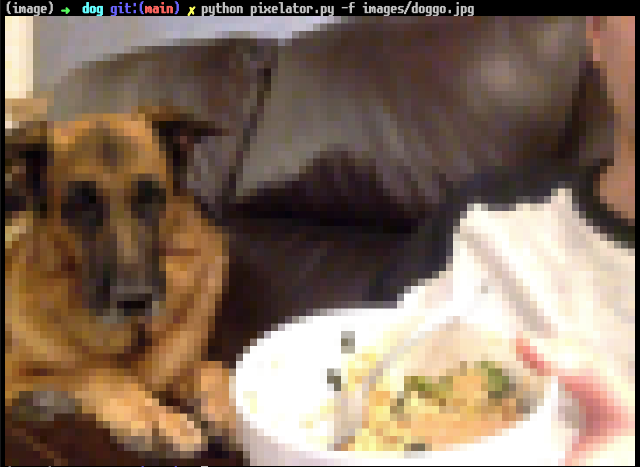
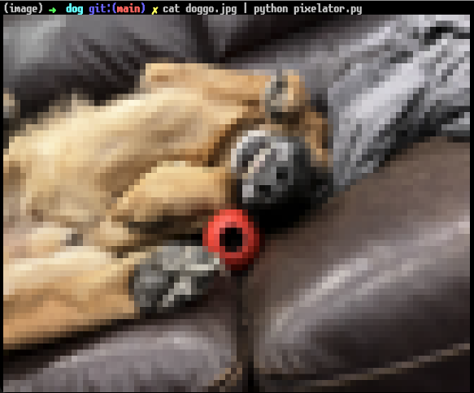
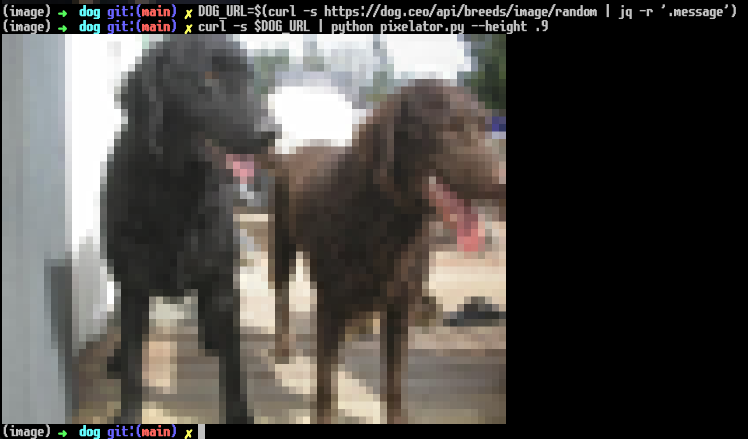

# Print Dogs to your Terminal!
Like me, you've probably thought to yourself: "I love my command line, but I feel like it could be enlivened through the addition of dogs". Well you can finally bridge the gap between reality and aspiration! 

This repo contains some code for taking an image and converting in into some ANSI formatted text that can be displayed in your terminal. 

## Requirements
requires NumPy and Pillow

## Using a filepath
You can just point pixelator.py at your favorite dog image using the -f or --file command line arguments!


## Streaming an image using Unix pipe
pixelator.py will also accept input from stdin, which means you can pass the image through a Unix pipe:

This is obviously very powerful, since it makes it easy to access dogs on the internet!!!

```
DOG_URL=$(curl -s https://dog.ceo/api/breeds/image/random | jq -r '.message')
curl -s $DOG_URL | python pixelator.py --height .9
```
## Scaling the image
By default the images will be scaled to fit the screen (slightly smaller in the vertical direction to allow room for the cursor). The width and height can be specified with the --width/-w and --height/-hg command line arguments respectively. 
